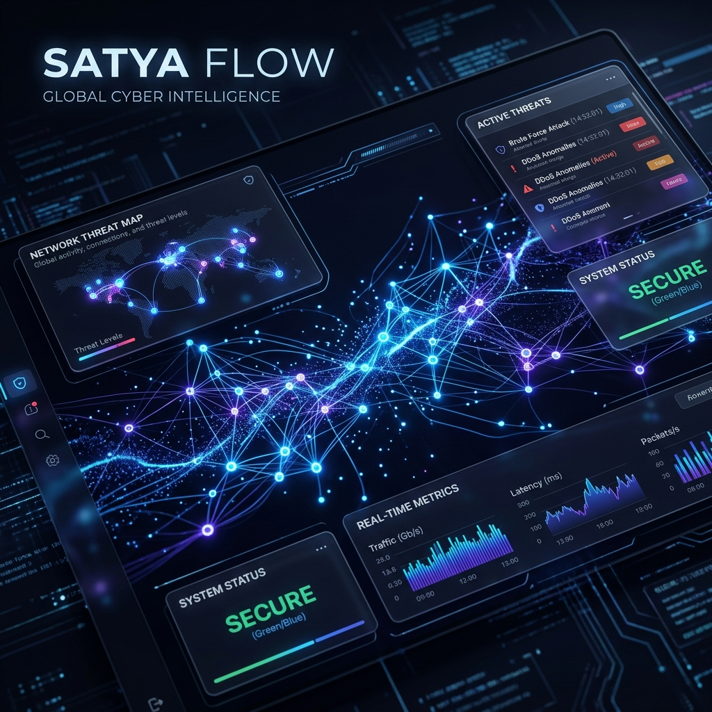

# TRACR: Intelligent AML Framework
## *Powered by SATYA FLOW — The Ethereal Ledger*

[]()
[]()
[]()
[]()



## 📌 Overview

**TRACR** is a state-of-the-art, high-performance financial crime detection ecosystem. At its core lies **SATYA FLOW**, an ethereal investigation dashboard designed for modern compliance teams. TRACR moves beyond traditional rule-based AML by utilizing real-time heuristics, graph-theoretic cycle detection, and Explainable AI (XAI) to expose sophisticated money laundering typologies—such as **Smurfing**, **Circular Trading**, and **Crypto-Layering**.

Nicknamed the "Sovereign Observer," TRACR processes high-volume transaction telemetry with sub-500ms latency, transforming raw data into actionable intelligence and automated regulatory filings.

---

## 🏗️ System Architecture

TRACR is built on a decoupled microservices architecture designed for extreme scale and visual fidelity.

### 1. The Intelligence Layer (SATYA FLOW)
The flagship Command Center built with **Next.js 15** and **React 19**. 
- **Cyber-War Room**: WebGL-accelerated 3D network graphing using `react-three-fiber` for multi-dimensional threat visualization.
- **Glassmorphic Design**: A premium, dark-mode first aesthetic optimized for deep focus and analyst ergonomics.
- **Real-time Engine**: Leverages WebSockets (Socket.io) for millisecond-accurate anomaly feeds.

### 2. The Core Engine (Backend)
High-concurrency processing built on **Node.js** and **Express.js**.
- **Detection Pipeline**: Graph-based DFS algorithms for uncovering complex circular trade loops.
- **Scoring System**: Multi-factor risk engine accounting for jurisdiction, velocity, and typology markers.
- **Explainable AI (XAI)**: Native integration with **Gemini 1.5 Flash** to generate automated, audit-ready **SAR (Suspicious Activity Report)** narratives.

### 3. Analytics & Forensics
- **Crypto-Forensics**: Specialized module for tracking on-chain suspicious activity and cross-chain hops.
- **Behavioral Profiling**: Rolling-window analysis that creates dynamic "normative" baselines for every entity.
- **Threat Simulator**: A Python-based ML heuristic generator for stress-testing detection logic via synthetic streams.

---

## ✨ Key Features

- 🌀 **Topological Discovery**: Visual alerts exposing structural threats and hidden cycles directly in the graph.
- 🤖 **Agentic Reporting**: Automated drafting of SARs using AI to reduce investigator fatigue by up to 70%.
- ⛓️ **Crypto Analysis**: Deep-dive analytics for blockchain-based financial crime detection.
- 📍 **Geospatial Heatmaps**: Global risk density mapping using Leaflet and D3.js.
- ⚡ **Live Inference**: Continuous monitoring with instant push-based alerts for high-risk events.

---

## 🚀 Getting Started

### 1. Prerequisites
- **Node.js**: v20+
- **Python**: v3.10+
- **MongoDB**: Local port `27017` or Atlas Cloud URI
- **API Keys**: Google Gemini API key for XAI features.

### 2. Configuration
Create a `.env` file in the `backend/` directory:
```env
MONGO_URI=mongodb+srv://tracr_user:tracrdbpassword@<YOUR_CLUSTER_ID>.mongodb.net/intelligent_aml
JWT_SECRET=your_secure_secret
GEMINI_API_KEY=your_gemini_api_key
```

### 3. Installation
**Backend:**
```bash
cd backend && npm install
```
**Frontend (SATYA FLOW):**
```bash
cd frontend-new && npm install
```

---

## 💻 Local Execution

Run the interconnected ecosystem using three concurrent processes:

1. **Start the Backend:**
   ```bash
   cd backend && npm start
   ```

2. **Start SATYA FLOW:**
   ```bash
   cd frontend-new && npm run dev
   ```

3. **Inject Synthetic Threats:**
   ```bash
   cd backend && python seed_data.py
   ```

---

## 🛠️ Technology Stack

| Layer | Tools |
| :--- | :--- |
| **Frontend** | Next.js 15, React 19, Tailwind CSS v4, Three.js, D3.js, Leaflet |
| **Backend** | Node.js, Express, Socket.io, MongoDB, JWT |
| **AI/ML** | Google Gemini 1.5 Flash, Python (Heuristics), Graph-DFS |
| **DevOps** | Jest, Python venv, NPM |

---

## 🛡️ License
Distributed under the MIT License. See `LICENSE` for more information.

---
*Created with ❤️ by the TRACR Engineering Team*
